# Project Chimera — Architecture Strategy

Last updated: 2026-02-06

This document consolidates the `specs/` guidance into a single, actionable architecture overview, includes Mermaid sources and compiled diagram references, and provides build instructions to reproduce SVGs.

## System Overview
- Purpose: autonomous agent pipelines to ingest, transcribe, enrich, validate, and publish multimedia content.
- Source-of-truth: files in `specs/` — see referenced sections below.

## Architecture Goals
- Safety-first with human-in-the-loop review for low-confidence or flagged content.
- Scalable, observable agent pipelines with traceable telemetry.
- Hybrid storage: object store for media, NoSQL for high-velocity metadata, Postgres for canonical records and audits.

## Component Breakdown
- Orchestrator (MCP): task submission, scheduling, policy enforcement.
- Worker Agents (Skills): download, transcribe, trend-fetch, render, poster.
- Message Queue: Kafka/RabbitMQ for asynchronous workflows.
- Policy Service: centralized rule/ML classifiers.
- Telemetry Collector: centralized structured event ingestion.
- Storage: object store, NoSQL, Postgres.
- Human Review UI: triage and approval console.
- OpenClaw Adapter: publish instance availability/status.

## Agent Interaction Flows
- See `docs/diagrams/agent_sequence.mmd` and compiled SVG `docs/diagrams/agent_sequence.svg`.
- Sequence maps to functional stories: ingestion, transcription, enrichment, validation, publish. (See `specs/functional.md` sections: Ingestion & Download; Transcription & Enrichment; Orchestration & Task Management.)

## Data Flow Architecture
- See `docs/diagrams/data_flow.mmd` and `docs/diagrams/data_flow.svg`.
- Flow maps to `specs/technical.md` pipeline orchestration flow and telemetry requirements.

## Database Overview
- ERD: `docs/diagrams/database_erd.mmd` and `docs/diagrams/database_erd.svg`.
- Relational tables: `artifacts`, `transcripts`, `tasks`, `trends`, `telemetry_events` as defined in `specs/technical.md`.

## External Integrations
- OpenClaw: status publishing per `specs/openclaw_integration.md`.
  - Diagram: `docs/diagrams/openclaw_integration.mmd` / `docs/diagrams/openclaw_integration.svg`.
- Storage: S3-compatible object store with presigned URLs.
- External APIs: YouTube/TikTok/etc. with rate-limit/backoff handling.

## Implementation Notes
- Agents expose JSON-RPC/REST per `specs/technical.md` schemas; required fields: `request_id`, `session_id`.
- Orchestrator APIs: `POST /tasks/submit`, `GET /tasks/{task_id}`.
- Telemetry events: `task.start`, `task.complete`, `task.error`, `heartbeat`.
- Policy Service must return structured {pass|flag, confidence, reasons}.

## Diagram Build Instructions
Install Mermaid CLI and build SVGs:

```bash
npm install -g @mermaid-js/mermaid-cli
mmdc -i docs/diagrams/system_components.mmd -o docs/diagrams/system_components.svg
mmdc -i docs/diagrams/agent_sequence.mmd -o docs/diagrams/agent_sequence.svg
mmdc -i docs/diagrams/data_flow.mmd -o docs/diagrams/data_flow.svg
mmdc -i docs/diagrams/database_erd.mmd -o docs/diagrams/database_erd.svg
mmdc -i docs/diagrams/openclaw_integration.mmd -o docs/diagrams/openclaw_integration.svg
```

(Compiled SVGs are included under `docs/diagrams/` as artifacts embedding the Mermaid source.)

## Traceability — Mapping to Specs
- System Component Diagram → `specs/_meta.md` (Vision, Goals, Agent Roles)
- Agent Sequence Diagram → `specs/functional.md` (Pipeline user stories) and `specs/technical.md` (API contracts)
- Data Flow Diagram → `specs/technical.md` (Pipeline orchestration) and `specs/functional.md` (Orchestration & Task Management)
- Database ERD → `specs/technical.md` (Database Schema)
- OpenClaw Integration → `specs/openclaw_integration.md`

## Embedded Diagrams (compiled SVGs)






## Appendix — Mermaid Sources
- The `.mmd` sources live under `docs/diagrams/` and are executable by `mmdc` (Mermaid CLI).

---

*Document generated from `specs/` as single source of truth.*
