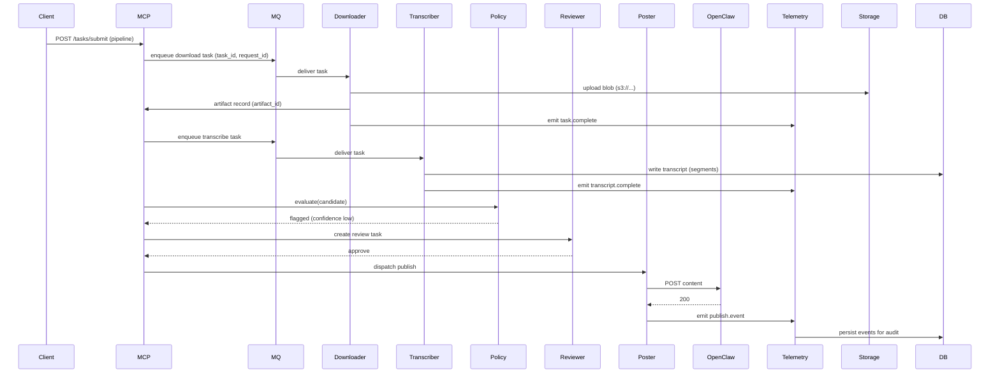
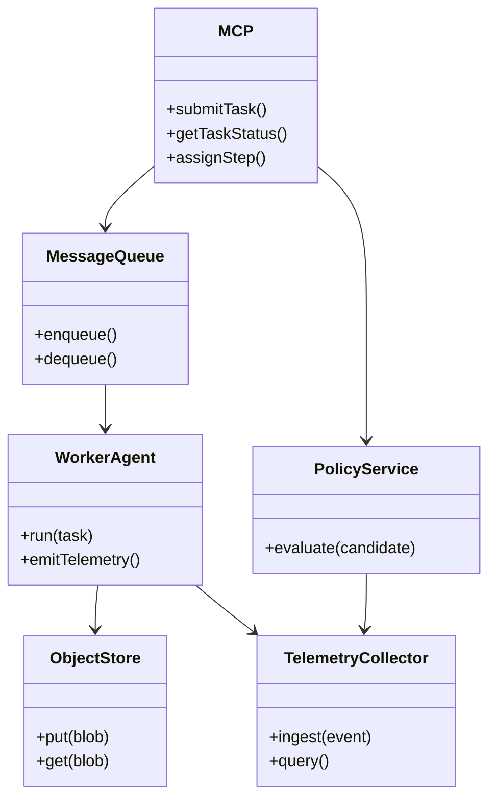
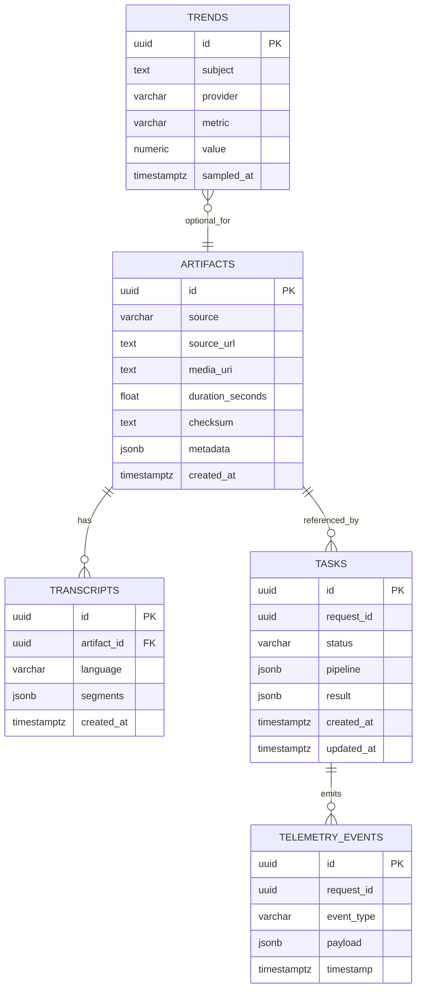

**Project Chimera — Architecture Strategy (Derived from Specs)**

Last updated: 2026-02-06

Overview
--------
This document consolidates the `specs/` guidance into a single, actionable architecture overview for Project Chimera. It maps vision, functional requirements, and technical contracts into system components, agent workflows, data/storage strategy, external integrations (including OpenClaw), and diagrams that can be used directly by implementers.

Goals & Constraints
-------------------
- Goal: build an autonomous, auditable pipeline that ingests media, enriches it (transcripts, trends), validates safety, and publishes content.
- Constraints: secrets via env/secret manager, structured telemetry with correlation IDs, horizontal scalability, and local dev reproducibility.

System Components
-----------------
- `Orchestrator` (MCP / controller)
  - Receives pipeline submissions (`POST /tasks/submit`), schedules steps, holds policy rules, and emits canonical task status.
- `Worker Agents` (skills)
  - `skill_download_youtube`, `skill_transcribe_audio`, `skill_trend_fetcher`, `skill_video_renderer`, `skill_poster`, etc.
  - Expose agent endpoints (JSON-RPC/REST) per `technical.md` contracts.
- `Message Queue` / Event Bus
  - Kafka / RabbitMQ for task queueing, backpressure, and reliable delivery.
- `Policy Service` (AutoPolicy)
  - Centralized microservice for rule-based checks and ML safety classifiers.
- `Telemetry Collector`
  - Central ingestion endpoint for structured events: task.start, task.complete, task.error, heartbeat.
- `Storage`
  - Object store (S3-compatible) for media blobs.
  - NoSQL store (MongoDB/Dynamo) for high-velocity metadata and flexible fields.
  - Postgres for canonical artifacts, audits, and relationships.
- `Human Review UI`
  - Triage and approval console showing video previews, scripts, and telemetry.
- `OpenClaw Adapter`
  - Publishes instance status and availability to OpenClaw, and optionally publishes content or status updates.

Agent Workflows & Interactions
-----------------------------
Typical pipeline (orchestrated by MCP):
1. Client or scheduler submits a `task` (pipeline array) to `POST /tasks/submit`.
2. MCP enqueues the first step into the Message Queue.
3. `skill_download_youtube` consumes task, downloads media, writes blob to object store, stores artifact record in Postgres (or NoSQL), emits telemetry.
4. `skill_transcribe_audio` reads artifact_id, transcribes, stores transcript (segments as jsonb) and emits telemetry.
5. `skill_trend_fetcher` gathers social metrics and stores trend samples.
6. `skill_video_renderer` assembles visuals if needed and produces candidate content.
7. MCP calls `Policy Service` for automated checks; if flagged or low confidence, MCP enqueues a human-review task.
8. Human approves → MCP dispatches `skill_poster` to publish via `OpenClawAdapter` or direct integration.

Interaction Patterns
- Synchronous: short RPC calls for step invocation (with `request_id`, `session_id`) and immediate success/error.
- Asynchronous: tasks longer than a few seconds use MQ and `task_id` tracking; callbacks optional.

Data Flows and Storage
----------------------
- Media Blobs
  - Stored in S3; `artifacts.media_uri` stores the canonical location. Use presigned URLs for worker uploads/downloads.
- Metadata & Telemetry
  - High-throughput metadata (trend samples, streaming checkpoints): NoSQL.
  - Canonical artifacts, transcripts, audits, and relational mappings: Postgres.
- Telemetry events: POST to `telemetry` collector; store raw events in `telemetry_events` table or a log store (ELK/Tempo).

Database Strategy Rationale
--------------------------
- Hybrid approach: NoSQL for flexible, high-volume writes; Postgres for auditability and relational integrity. This maps directly to `technical.md` and the functional need for auditable human decisions.

Security & Operational Notes
---------------------------
- Secrets via environment or secrets manager; no plaintext in repo.
- mTLS for internal RPC; Bearer API keys for external integrations.
- Retry/backoff/jitter and circuit breakers for external APIs.
- Telemetry must include `trace_id`, `request_id`, `task_id` for full observability.

Mermaid Diagrams
----------------
Below are diagrams for engineers to use in docs, PRs, and design sessions.

Flowchart — End-to-end Pipeline
```mermaid
flowchart LR
  A[Submit Task / API] --> B[Orchestrator (MCP)]
  B --> C[Enqueue Step -> MQ]
  C --> D[Download Agent]
  D --> E{Success?}
  E -- no --> F[Mark Task Failed -> Telemetry]
  E -- yes --> G[Store Artifact -> Object Store + Artifacts Table]
  G --> H[Transcribe Agent]
  H --> I[Transcript Stored]
  I --> J[Trend Fetcher]
  J --> K[Enrich Metadata]
  K --> L[Policy Service]
  L --> M{Pass?}
  M -- no --> N[Human Review Queue -> Human Review UI]
  N --> O[Approve -> MCP]
  M -- yes --> O
  O --> P[Poster Agent]
  P --> Q[OpenClaw / External Publish]
  Q --> R[Telemetry Collector]
  R --> S[Feedback / Audit ETL -> Postgres]
```

Sequence Diagram — Download → Transcribe → Publish


Component Diagram — Key Modules


ERD — Core Relational Model


Integration — OpenClaw (Availability & Status)
------------------------------------------------
- Publish heartbeat/status to `OPENCLAW_BASE_URL` using `OPENCLAW_API_KEY`.
- Payload includes `instance_id`, `version`, `capabilities`, `capacity`, and `health`.
- Heartbeat frequency: default 30s (adjustable). Implement exponential backoff if publish fails.

Example OpenClaw status payload:

```json
{
  "service_name": "project-chimera",
  "instance_id": "<host-uuid>",
  "timestamp": "2026-02-06T12:00:00Z",
  "uptime_seconds": 12345,
  "version": "0.1.0",
  "capabilities": ["download","transcribe","trend_fetch"],
  "capacity": {"concurrent_tasks": 4, "queue_length": 10},
  "health": {"status":"healthy","details":{"last_task_success_seconds":30}}
}
```

APIs and Contracts (Actionable)
--------------------------------
- Agents must accept and return the JSON schemas in `technical.md` (request_id, session_id, artifact_id, etc.).
- Orchestrator should implement `POST /tasks/submit` and `GET /tasks/{task_id}` to return canonical status and per-step outcomes.
- Telemetry endpoint: `POST /telemetry` for ingestion of structured events.

Operational Checklist (Next Steps)
---------------------------------
1. Implement minimal MCP + Message Queue + `skill_download_youtube` and `skill_transcribe_audio` following API contracts.
2. Add Telemetry Collector and wire `task.start`, `task.complete`, `task.error`, `heartbeat` events.
3. Implement `Policy Service` and a human review UI that subscribes to flags.
4. Add OpenClaw Adapter and start publishing instance heartbeats.

Auditing & Feedback Loop
------------------------
- Persist human review decisions and reason codes in Postgres for audit and model retraining.
- ETL pipeline: batch telemetry and enrich events into the relational store for analytics and SLA monitoring.

Appendix — Example Task Message (MQ)
-----------------------------------
```json
{
  "task_id": "task-uuid",
  "type": "download",
  "payload": {"source_url":"https://..."},
  "trace_id": "trace-uuid",
  "priority": "normal",
  "retry_count": 0
}
```

Closing
-------
This consolidated architecture is derived from `specs/_meta.md`, `specs/functional.md`, and `specs/technical.md` and includes the OpenClaw integration specifics. It is designed to be directly actionable for engineers implementing agent runtimes, skills, policy checks, telemetry, and publishing adapters.

External SVG Diagram Files
--------------------------
The following external SVG files were generated alongside this document. Each file contains the Mermaid source used to render the diagram. Use a Mermaid renderer (VSCode Mermaid Preview, GitHub, or mermaid-cli) to produce a fully styled SVG if you prefer a graphical rendering; the files below embed the original Mermaid source for portability.

- Flowchart (data flow): [research/diagrams/flowchart_data_flow.svg](research/diagrams/flowchart_data_flow.svg)

Mermaid source for `flowchart_data_flow.svg`:
```mermaid
flowchart LR
  A[Submit Task / API] --> B[Orchestrator (MCP)]
  B --> C[Enqueue Step -> MQ]
  C --> D[Download Agent]
  D --> E{Success?}
  E -- no --> F[Mark Task Failed -> Telemetry]
  E -- yes --> G[Store Artifact -> Object Store + Artifacts Table]
  G --> H[Transcribe Agent]
  H --> I[Transcript Stored]
  I --> J[Trend Fetcher]
  J --> K[Enrich Metadata]
  K --> L[Policy Service]
  L --> M{Pass?}
  M -- no --> N[Human Review Queue -> Human Review UI]
  N --> O[Approve -> MCP]
  M -- yes --> O
  O --> P[Poster Agent]
  P --> Q[OpenClaw / External Publish]
  Q --> R[Telemetry Collector]
  R --> S[Feedback / Audit ETL -> Postgres]
```

- Sequence diagram (agents): [research/diagrams/sequence_agents.svg](research/diagrams/sequence_agents.svg)

Mermaid source for `sequence_agents.svg`:


- Component diagram: [research/diagrams/component_system.svg](research/diagrams/component_system.svg)

Mermaid source for `component_system.svg`:


- ERD (relational model): [research/diagrams/erd_core_model.svg](research/diagrams/erd_core_model.svg)

Mermaid source for `erd_core_model.svg`:


