# Project Chimera — Spec Kit

## Vision

Project Chimera is an agentic infrastructure that enables autonomous, auditable, and extensible skills for ingesting, processing, and surfacing multimedia insights (video and audio). The platform composes lightweight agents (downloaders, transcribers, trend fetchers, telemetry, orchestrators) into repeatable pipelines and exposes contract-first APIs so developer teams can build, integrate, and operate capabilities quickly and reliably.

## Goals

- Provide reliable, observable agent pipelines for multimedia ingestion and processing.
- Offer simple, well-documented API contracts so third-party agents and frontends can integrate without deep coupling.
- Persist canonical artifacts (media metadata, transcripts, trends) with a clear, extensible schema.
- Ensure graceful degradation with retries, backoff, and circuit-breaker patterns for external dependencies.
- Publish runtime availability and status to the OpenClaw network for discovery and health monitoring.

## Non-functional Constraints

- Security: Secrets and API keys are supplied via environment variables or secrets manager; never stored in plain text in the repo.
- Observability: All agents must emit structured telemetry (JSON) including correlation IDs, session/task IDs, and outcome codes.
- Scalability: Agents must be horizontally scalable; storage choices and indexes must accommodate high ingest rates.
- Portability: Provide a minimal local dev runner (Docker or Python virtualenv) to verify pipelines locally.

## Stakeholders

- Platform Engineers — operate and maintain the runtime and infra.
- Skill Developers — implement agents for ingestion, transformation, enrichment.
- Data Consumers — frontends and analytics that depend on transcripts and trends.

## Success Metrics

- Time-to-first-successful-pipeline run after clone: < 30 minutes (local dev).
- End-to-end pipeline success rate (healthy infra): >= 98%.
- Mean time to detect agent failure: < 60 seconds (via telemetry/heartbeats).

## Roadmap

1. Core runtime + orchestrator + telemetry baseline.
2. Implement `skill_download_youtube` and `skill_transcribe_audio` with contract tests.
3. Add `skill_trend_fetcher` and persistence adapters (Postgres + object store for media).
4. Integrate OpenClaw status publishing and CI checks for contract validation.

## Developer Checklist

- Conform to API contract schemas in `technical.md` when implementing agents.
- Write unit tests that validate input schema and produce sample output fixtures.
- Emit telemetry events for: task.start, task.complete, task.error, heartbeat.
- Add a lightweight runner script under `scripts/` that runs a single pipeline end-to-end with environment variables for credentials.

## System Component Diagram

This diagram maps to: Agent Roles, Core runtime components, and Roadmap items in this file.
# Project Chimera — Meta Specification

## Vision
Project Chimera is an autonomous AI influencer system that detects trends, generates multimedia content, validates it, and publishes across platforms.

## Objectives
- Fully autonomous content production pipeline
- Multi-agent orchestration via MCP + LangGraph
- Skill-based modular runtime
- Governance-first development

## Constraints
- All code must align with specs before implementation
- Agents must be observable and auditable
- Skills must expose Input/Output contracts
- All runtime outputs must pass validation

## Agent Roles
- Planner Agent
- Trend Research Agent
- Content Generator Agent
- Validator Agent
- Publisher Agent

## Non-Functional Requirements
- Security
- Traceability
- Reproducibility
- Cloud deployability
