# Functional Specification — User Stories

All user stories follow the pattern: "As an Agent, I need to [action] so that [goal]."

## Ingestion & Download
- As an Agent, I need to download video/audio from an external source (e.g., YouTube) so that the system has canonical media artifacts for processing and archival.
- As an Agent, I need to validate downloaded media checksum and format so that downstream processors can rely on consistent inputs.

## Transcription & Enrichment
- As an Agent, I need to transcribe audio into time-coded text segments so that consumers can search, highlight, and analyze spoken content.
- As an Agent, I need to produce per-segment confidence scores and simple speaker labels so that downstream UI and analytics can prioritize reliable content.

## Trend Fetching & Metadata
- As an Agent, I need to fetch trend and metadata (title, description, tags) for a media item so that we can enrich the canonical record and support discovery.

## Orchestration & Task Management
- As an Agent, I need to schedule and orchestrate a pipeline (download -> transcribe -> enrich -> store) so that complex multi-step processing executes reliably and can be retried upon transient failures.
- As an Agent, I need to emit a single canonical task status (queued/running/success/failure) so that consumers and dashboards can show pipeline progress.

## Telemetry & Observability
- As an Agent, I need to emit structured telemetry events for start/complete/error so that operational teams can alert and triage quickly.
- As an Agent, I need to emit heartbeat/health status periodically so that orchestrator can mark unhealthy agents and re-route tasks.

## Storage & Retrieval
- As an Agent, I need to persist media metadata, transcript segments, and derived trend records in the database so that UI and analytics can query them.
- As an Agent, I need to store raw media blobs in an object store (or local disk in dev) so that media can be reprocessed without re-downloading.

## API & Integration
- As an Agent, I need to expose a minimal JSON RPC/REST API for submitting tasks and checking status so that external services can programmatically trigger processing.
- As an Agent, I need to validate incoming request schema and return helpful error messages (400) so that integrators can fix contract violations quickly.

## OpenClaw / Availability
- As an Agent, I need to publish my availability/status to OpenClaw so that network-level discovery and centralized monitoring can reflect current capacity.

## Security & Access
- As an Agent, I need to require API keys for write operations and optional read tokens for protected artifact access so that access control can enforce organizational policies.
# Functional Specifications

## User Stories

### Trend Discovery
As an Agent, I need to fetch trending topics from social media APIs so that content remains relevant.

### Content Generation
As an Agent, I need to generate script drafts, captions, and visual layouts.

### Content Validation
As an Agent, I need to validate safety, grammar, and brand compliance.

### Publishing
As an Agent, I need to publish approved content automatically.

### Status Broadcasting
As an Agent, I need to publish system health and availability status.

## Agent Workflow Diagram

This diagram maps to the ingestion, transcription, enrichment, validation, and publishing user stories above.
