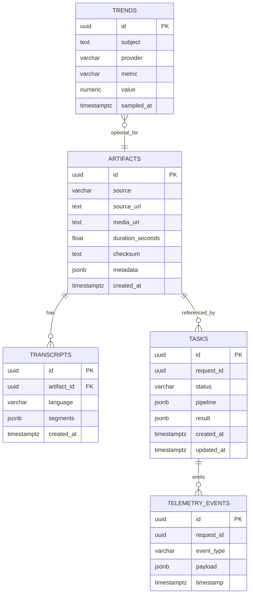
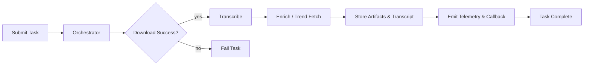

# Technical Specification

This document defines API contracts (JSON schemas), storage schema, and operational notes required for implementation.

## API Contracts

Overview: Agents accept JSON task requests and return structured responses. All requests MUST include `request_id` (UUID) and `session_id` (optional) for correlation.

### 1) Download Agent (skill_download_youtube)

- Endpoint (example): `POST /agents/download`
- Purpose: Fetch a video/audio by source URL and store the artifact.

Request schema (input):

```json
{
  "request_id": "uuid-v4",
  "session_id": "optional-uuid",
  "source": "youtube",
  "source_url": "https://www.youtube.com/watch?v=abc123",
  "preferred_formats": ["mp4", "webm"],
  "metadata": { "source_user": "uploader", "tags": [] }
}
```

Response schema (success):

```json
{
  "request_id": "uuid-v4",
  "status": "success",
  "artifact": {
    "artifact_id": "artifact-uuid",
    "media_uri": "s3://bucket/path/file.mp4",
    "duration_seconds": 123.45,
    "checksum": "sha256:...",
    "metadata": {"title":"...","uploader":"..."}
  },
  "warnings": []
}
```

Response schema (failure):

```json
{
  "request_id": "uuid-v4",
  "status": "error",
  "error": {"code": "download_failed", "message": "Timed out"}
}
```

### 2) Transcribe Agent (skill_transcribe_audio)

- Endpoint: `POST /agents/transcribe`
- Purpose: Turn audio artifact into time-aligned transcript segments.

Request schema:

```json
{
  "request_id":"uuid-v4",
  "artifact_id":"artifact-uuid",
  "language":"en-US",
  "model":"openai-whisper-v1",
  "options": {"diarization":true, "profanity_filter":false}
}
```

Response schema (success):

```json
{
  "request_id":"uuid-v4",
  "status":"success",
  "transcript_id":"transcript-uuid",
  "segments":[
    {"start":0.0, "end":3.2, "text":"Hello world", "confidence":0.98, "speaker":1}
  ],
  "language":"en-US"
}
```

Response schema (error): similar to download agent.

### 3) Trend Fetcher Agent (skill_trend_fetcher)

- Endpoint: `POST /agents/trend_fetch`
- Purpose: Retrieve public trend metrics for a media item or topic.

Request schema:

```json
{
  "request_id":"uuid-v4",
  "query":"topic or media_id",
  "providers":["youtube","twitter"],
  "time_range": {"from":"2026-01-01T00:00:00Z","to":"2026-01-07T00:00:00Z"}
}
```

Response schema:

```json
{
  "request_id":"uuid-v4",
  "status":"success",
  "trends": [
    {"provider":"youtube","metric":"views","value":12345}
  ]
}
```

### 4) Orchestrator / Task API

- Endpoint: `POST /tasks/submit`
- Purpose: Submit a pipeline (array of agent tasks) and receive a `task_id` for tracking.

Request schema:

```json
{
  "request_id":"uuid-v4",
  "pipeline": [
    {"agent":"download","input":{...}},
    {"agent":"transcribe","input":{...}}
  ],
  "callback_url":"optional-callback"
}
```

Response schema:

```json
{
  "request_id":"uuid-v4",
  "task_id":"task-uuid",
  "status":"queued"
}
```

Status check: `GET /tasks/{task_id}` returns a canonical status with per-step outcomes.

## Database Schema

Target: Postgres (relational) for metadata and transcripts; object store for media blobs.

Tables (columns abbreviated):

1) `artifacts`
- `id` (uuid, PK)
- `source` (varchar)
- `source_url` (text)
- `media_uri` (text)
- `duration_seconds` (float)
- `checksum` (text)
- `metadata` (jsonb)
- `created_at` (timestamptz)

2) `transcripts`
- `id` (uuid, PK)
- `artifact_id` (uuid, FK -> artifacts.id)
- `language` (varchar)
- `segments` (jsonb) -- array of {start,end,text,confidence,speaker}
- `created_at` (timestamptz)

3) `tasks`
- `id` (uuid, PK)
- `request_id` (uuid)
- `status` (enum: queued,running,success,failed)
- `pipeline` (jsonb)
- `result` (jsonb)
- `created_at`, `updated_at`

4) `trends`
- `id` (uuid, PK)
- `subject` (text) -- e.g., media id or topic
- `provider` (varchar)
- `metric` (varchar)
- `value` (numeric)
- `sampled_at` (timestamptz)

5) `telemetry_events`
- `id` (uuid, PK)
- `request_id` (uuid)
- `event_type` (varchar)
- `payload` (jsonb)
- `timestamp` (timestamptz)

### Database ERD (Mermaid)

The diagram below is an ERD expressed in Mermaid syntax for GitHub preview. It is the canonical reference for the relational model described above.



(Fallback ASCII for quick reference)

artifacts(id) 1---* transcripts(artifact_id)
tasks(id) holds pipeline as json -> references artifact/transcript ids
trends(id) independent table with subject foreign keys optional

## Storage & Access Patterns

- Media blobs: store in object store (S3-compatible). Store `media_uri` in `artifacts.media_uri`.
- Transcript reads: often by id for display; add index on `transcripts.artifact_id`.
- Task queries: index `tasks.status` to support dashboard queries.

## Operational Notes

- Telemetry: All agents send events to a central collector endpoint `POST /telemetry` with payload `{request_id, event, level, payload}`.
- Retries: Use exponential backoff with jitter; mark a task failed after configurable attempts (default 5).
- Authentication: API requests use `Authorization: Bearer <API_KEY>` header; key validation performed by gateway.

## Database Architecture Diagram


This ERD diagram maps to the `Database Schema` section above and is the canonical reference for table relationships used by agents and the orchestrator.
Input:
{
  "platform": "youtube",
  "region": "global"
}

Output:
{
  "trends": [
    {
      "title": "string",
      "score": "number",
      "url": "string"
    }
  ]
}
Input:
{
  "trend_title": "string"
}

Output:
{
  "script": "string",
  "caption": "string"
}

## System Workflows (Mermaid Flowcharts)

### Pipeline Orchestration Flow



### Telemetry / OpenClaw Publish Flow

```mermaid
flowchart TD
  A[Agent runtime] --> B[Assemble Status Payload]
  B --> C[POST to OpenClaw /openclaw/status]
  C --> D{HTTP 2xx?}
  D -- yes --> E[Log Success Telemetry]
  D -- no --> F[Schedule Retry (backoff)]
  F --> C
```
